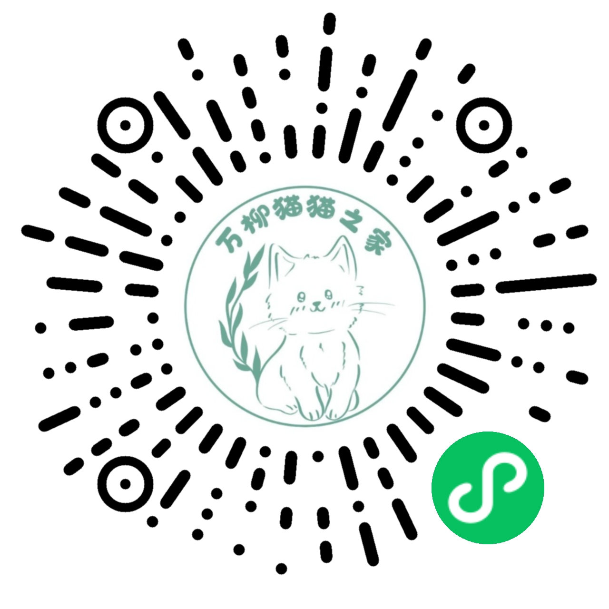

# 北理珠流浪猫关爱部 · 小程序

> 北理珠（北京理工大学珠海学院）流浪猫关爱部官方微信小程序，用于**查猫、看小猫书、发布与了解校园猫咪动态**。



---

## 目录

1. [项目简介](#一项目简介)
2. [特别鸣谢](#特别鸣谢)
3. [功能总览](#二功能总览)
4. [技术栈](#三技术栈)
5. [目录结构](#四目录结构)
6. [数据库集合说明](#五数据库集合说明)
7. [从零部署（新手必看）](#六从零部署新手必看)
8. [密钥与云函数环境变量（重要，必读）](#七密钥与云函数环境变量重要必读)
9. [后台管理（管理员）](#八后台管理管理员)
10. [内容安全与黑名单清退（防封禁）](#九内容安全与黑名单清退防封禁)
11. [日常维护](#十日常维护)
12. [常见问题 FAQ](#十一常见问题-faq)

---

## 一、项目简介

这是一个基于 **微信小程序 + 阿里云 MPServerless 云开发 + 腾讯云 COS 图片存储** 的猫咪信息平台，包含三块核心内容：

- **猫档案**：每只校园猫的姓名、毛色、性格、状态（健康 / 送养 / 失踪 / 离世 / 待抓）、绝育情况、照片等。
- **小猫书**：社团成员发布的图文动态（推文），可以点赞、评论、关联到某只猫和话题。
- **相关话题**：自动聚合「某只猫出现在哪些话题的推文里」，支持多选话题、在详情页内联查看文章，并按拍摄时间 / 发布时间排序。

> 本项目**不依赖服务器运维**：数据存在阿里云 MPServerless，图片存在腾讯云 COS，小程序端代码即全部业务逻辑。照着下面的「从零部署」一步步走，一个没接触过后端的人也能跑起来。

---

## 特别鸣谢

本项目基于 **[万柳猫咪图鉴]**（校园流浪猫图鉴开源小程序）二次开发改造而来，**特此鸣谢原项目作者与万柳猫猫之家**。

- 保留原项目 Logo（`万柳猫咪图鉴.jpg`）作为本项目图标基础。
- 在原项目核心能力（查猫、图鉴、小猫书等）之上，针对**北理珠流浪猫关爱部**的实际需求进行了功能扩展与重构（详细变更见 [changeLog.md](./changeLog.md)）。
- 遵循原项目开源协议 [MIT](./license)，本项目二次开发成果同样以 MIT 协议开源。

---

## 二、功能总览

### 面向普通用户

| 功能 | 说明 |
| --- | --- |
| 查猫 | 按关键词搜索猫（支持空格 / 多关键词分词），可看「在校 / 离校」等分类 |
| 猫详情 | 照片轮播、状态 / 绝育标签、详细资料展开收起、相关猫咪、相关话题聚合 |
| 小猫书 | 图文瀑布流，点击进入详情；按拍摄时间 / 发布时间 / 点赞排序 |
| 发布动态 | 底部中间「+」按钮发布小猫书（未注册用户先引导注册） |
| 公告弹窗 | 打开首页 / 搜索页时展示社团公告 |
| 关于 | 社团介绍、联系方式、广告位 |

### 面向管理员（`app.globalData.isAdministrator` 为真时）

| 功能 | 说明 |
| --- | --- |
| 添加 / 编辑猫咪 | 支持照片上传、状态标签、关系维护（改名后自动同步推文关联） |
| 添加 / 编辑小猫书 | 图文编辑、话题标签、封面设置、草稿自动保存 |
| **搜索用户名 / 用户ID** | 首页搜索框输入用户名或 openid，即可筛选出该用户的全部推文 |
| **封锁 / 解封帖子** | 长按推文进入编辑页，可直接软下架该帖（取证留存，可在复核中心恢复） |
| 编辑公告 | 修改首页 / 搜索页弹窗公告 |
| 回收站 | 猫咪回收站（catTrash）与推文回收站（pageTrash）可恢复 / 彻底删除 |
| 复核中心 | 处理举报、申诉、疑似违规内容（下架 / 封禁 / 解封 / 忽略） |
| 审核开关 | 通过 `Administrator` 集合第一条记录控制「是否开放注册 / 发布」 |

### 其他细节

- **自定义 tabBar**：小红书式底部导航，中间凸起加号即发布入口，4 个 tab 页自动同步选中态。
- **草稿机制**：编辑页（猫咪 / 小猫书）自动保存草稿，退出后再次进入可恢复，清缓存不误弹。
- **图片回退**：图片加载失败逐级回退（`png → 0.jpg → 占位图`），避免 COS 缺图显示空白。
- **主题变量**：全站统一使用 `var(--color-*)` 设计令牌（主色粉 `#FF405E`），换主题只需改 `app.wxss`。

---

## 三、技术栈

| 层 | 技术 |
| --- | --- |
| 前端 | 微信小程序原生（WXML / WXSS / JS） |
| 后端 | 阿里云 MPServerless 云开发（`@alicloud/mpserverless-sdk`） |
| 图片存储 | 腾讯云 COS（`cos-wx-sdk-v5`），支持云函数签发临时密钥（STS） |
| 云函数 | 共 4 个：`getCosSts`（可选，COS 临时密钥）、`secCheck`（内容安全审核）、`moderate`（封禁/解封执行器）、`feishuCallback`（飞书指令联动，进阶） |
| 单元测试 | 已清理（历史上有基于 `utils/` 的 Node 单测，需要时可重建，见 FAQ） |

> ⚠️ 小程序是纯前端项目，`config.js` 里的前端密钥（MPServerless 客户端密钥、COS 固定密钥）反编译即可看到。**务必**：COS 尽量启用 STS 临时密钥；MPServerless 开启数据库权限校验。所有**云函数密钥**一律走环境变量，**绝不写进代码、绝不提交到仓库**（详见[第七节](#七密钥与云函数环境变量重要必读)）。

---

## 四、目录结构

```
BITZH/
├── miniprogram/               # 小程序主体（在微信开发者工具中打开这个目录）
│   ├── app.js                 # 入口：初始化 MPServerless、登录授权、更新检查
│   ├── app.json               # 页面注册、tabBar 配置
│   ├── app.wxss               # 全局样式 + 主题变量（--color-*）
│   ├── config.js              # 真实密钥配置（本地，已被 .gitignore 忽略，需自己创建）
│   ├── config.example.js      # 配置模板（提交到仓库，只含示例值）
│   ├── pages/                 # 页面
│   │   ├── index/             # 首页：小猫书瀑布流（含用户名/ID 搜索）
│   │   ├── catSearch/         # 查猫页
│   │   ├── catDetail/         # 猫详情
│   │   ├── bookletDetail/     # 小猫书详情
│   │   ├── mydetail/          # 我的
│   │   ├── about/             # 关于
│   │   ├── addCat|editCat/    # 添加 / 编辑猫咪（管理员）
│   │   ├── addBooklet|editBooklet/  # 发布 / 编辑小猫书
│   │   ├── regist/            # 用户注册
│   │   ├── Administrator/     # 管理后台入口
│   │   ├── catTrash|pageTrash/# 猫咪 / 推文回收站
│   │   ├── editAnnouncement/  # 编辑公告（管理员）
│   │   ├── someBooklet/       # 按分类浏览小猫书
│   │   ├── 所有/              # 所有猫咪列表
│   │   ├── report/            # 举报页
│   │   ├── appeal/            # 申诉页
│   │   ├── banned/            # 全屏封禁页
│   │   ├── reviewCenter/      # 内容安全复核中心（管理员）
│   │   ├── templates/         # 公共 WXML 模板（黑名单弹窗 / 公告弹窗 / 推文卡片）
│   │   └── images/            # 静态图片资源
│   ├── components/            # 自定义组件：关系编辑器、话题编辑器、图片排序
│   ├── custom-tab-bar/        # 自定义底部导航
│   ├── utils/                 # 公共工具（数据库、COS、排序、话题、草稿、回收站、审核等）
│   ├── project.config.json    # 微信开发者工具项目配置（有效配置）
│   ├── sitemap.json           # 微信搜索收录配置
│   └── package.json           # npm 依赖
├── cloudfunctions/            # 云函数（可选/进阶，最小可用部署不依赖）
│   ├── getCosSts/             # COS 临时密钥云函数（可选）
│   ├── secCheck/              # 内容安全审核云函数（msgSecCheck + 敏感词 + 飞书推送）
│   ├── moderate/              # 封禁/解封/下架/恢复执行器（服务端写库）
│   └── feishuCallback/        # 飞书自建应用消息回调（评论发指令封禁/解封）
├── changeLog.md               # 版本更新记录
├── 已知问题.md                # 已修复/待关注的问题清单
├── 测试清单.md                # 手动测试清单
├── license                    # MIT 开源协议
└── 万柳猫咪图鉴.jpg           # 项目 Logo
```

> 注：`manage/`（旧数据转换脚本）、`test/`（单测与检查清单）已清理；如需跑测试，参考「常见问题」中重建测试的说明。

---

## 五、数据库集合说明

> 集合都在**阿里云 MPServerless 控制台 → 云数据库**里手动创建。**「核心集合」是跑通基本功能必需的**；「高级功能集合」只在启用内容安全/举报/申诉时才需要。

### 核心集合（最小可用部署必建，8 个）

| 集合 | 用途 | 主要字段 |
| --- | --- | --- |
| `BITZH` | 猫咪档案 | `name` 名字、`addPhotoNumber` 照片数、`status` 状态、`isSterilization` 绝育、`furColor` 毛色、`relatedCats` 相关猫咪、`appearance` 外貌等 |
| `Page` | 小猫书（推文） | `tittle` 标题、`relative` 关联标签（话题 / 猫名）、`pageTime`/`photoTime` 时间、`good` 点赞、`authorId`/`author`/`authorImg` 作者、`hidden` 是否被封 |
| `Feeder` | 用户资料 | 昵称、头像、`userId`（openid）等 |
| `Notice` | 公告 | 公告内容、是否展示 |
| `Comment` | 评论 | 小猫书下的评论 |
| `Administrator` | 审核开关 | 一条记录存放「是否开放注册 / 发布」等开关，其 `_id` 填到 `config.js` 的 `administratorRecordId` |
| `BITZHAdministrator` | **管理员名单** | 每条记录一个管理员：`userId`（openid）+ `name`（姓名） |
| `BlackNum` | 黑名单 | 被封禁用户的 `id`（= openid）、`reason`、`time` |

### 高级功能集合（启用内容安全/举报/申诉时才建）

| 集合 | 用途 | 主要字段 |
| --- | --- | --- |
| `Report` | 举报 | `targetType`(page/comment)、`targetId`、`reason`、`reporterId`、`targetAuthorId`、`status` |
| `Appeal` | 申诉 | `userId`、`detail`、`contact`、`status` |
| `Review` | 内容安全证据 / 待复核 | `type`(review/evidence)、`content`、`category`、`scene`、`status` |
| `ReportAgg` | 举报去重计数 | `targetType`、`targetId`、`reporters`（举报人数组，原子去重） |

### 存档集合（编辑/删除时自动生成，一般无需手动建，无权限会自动报错再补）

| 集合 | 用途 |
| --- | --- |
| `Pagechange` | 小猫书「编辑前」快照（一键恢复上次数据） |
| `Delete` | 小猫书「删除前」快照（帖子回收站恢复） |
| `BITZHchange` | 猫咪「编辑前」快照 |
| `BITZHdelete` | 猫咪「删除前」快照（猫咪回收站恢复） |

---

## 六、从零部署（新手必看）

> 跟着本教程走一遍，**最小可用（能查猫、发帖、看图）大约 30–60 分钟**。
> 每一步都写清楚了，照做即可。中途卡住先看文末 [FAQ](#十一常见问题-faq)。

### 🗺️ 先看这张路线图：哪些必须做、哪些能跳过

| # | 步骤 | 是否必须 | 说明 |
| --- | --- | --- | --- |
| 1 | 准备环境（微信开发者工具 + 小程序账号） | ✅ 必做 | 10 分钟 |
| 2 | 导入项目 + 构建 npm | ✅ 必做 | 5 分钟 |
| 3 | 创建后端空间（MPServerless） | ✅ 必做 | 10 分钟 |
| 4 | 创建图片存储（腾讯云 COS） | ✅ 必做 | 10 分钟 |
| 5 | 创建 `config.js` 并填写 | ✅ 必做 | 10 分钟 |
| 6 | 配置管理员 + 审核开关 | ✅ 必做 | 5 分钟 |
| 7 | 首次运行 | ✅ 必做 | 5 分钟 |
| 8 | 上传体验版 / 发布 | ✅ 必做（要上线的话） | 5 分钟 |
| 9 | 开启 COS 临时密钥 STS（更安全） | ⭕ 可跳过 | 进阶，10 分钟 |
| 10 | 内容安全审核 `secCheck` | ⭕ 建议做、可跳过 | 防封禁，10 分钟 |
| 11 | 举报 / 申诉 / 复核中心 | ⭕ 可跳过 | 依赖第 10 步 |
| 12 | 飞书机器人联动（评论区封禁） | ⭕ 可跳过 | 进阶，可选 |

> 结论：**第 1–8 步是「必做」**，做完小程序就能正常用。第 9–12 步是「可选增强」，不部署也不会报错，小程序会自动降级（例如没部署 `secCheck` 就不做审核、没开 STS 就用固定密钥），适合新手先跑通再回头补。

---

### 1. 准备环境（约 10 分钟）

1. 安装 [微信开发者工具](https://developers.weixin.qq.com/miniprogram/dev/devtools/download.html)（选「稳定版」）。
2. 注册一个微信小程序账号：
   - 电脑浏览器打开 [微信公众平台](https://mp.weixin.qq.com/) → 注册「小程序」类型账号；
   - 注册后在「开发 → 开发管理 → 开发设置」里能看到 **AppID**（`wx` 开头的一串字符）和 **AppSecret**（只在后台能看到，别外泄）。
   - 只想本地试试、不发布的话，开发者工具里也可以直接用「测试号」，跳过注册。

### 2. 导入项目 + 构建 npm（约 5 分钟）

1. 打开微信开发者工具，**扫码登录**。
2. 点「+」→ **导入项目**：
   - 目录选择本仓库下的 **`miniprogram/`** 文件夹（不是仓库根目录）；
   - AppID 填上一步拿到的（或选「测试号」）；
   - 点「确定」。
3. 导入后点菜单栏 **工具 → 构建 npm**（本项目依赖阿里云 SDK 和 COS SDK，会生成 `miniprogram_npm` 目录）。若弹出「是否构建 npm」提示，点**确定**。
4. 此时编译会报「找不到 `config.js`」——**这是正常的**，因为 `config.js` 被 `.gitignore` 忽略了，需要下一步自己创建。

### 3. 创建后端空间（阿里云 MPServerless，约 10 分钟）

本项目后端用阿里云 MPServerless（云开发），存数据、做登录鉴权。

1. 打开 [MPServerless 控制台](https://mpserverless.console.aliyun.com)（需阿里云账号，没有就注册一个）。
2. 创建一个**云开发空间**（地区建议选离你近的节点，如「华东 1」）。
3. 在「空间详情」里记下 4 样东西：
   - **AppID**（不是微信 AppID，是 MPServerless 空间对应的 AppID）
   - **空间 ID**（spaceId）
   - **客户端密钥**（clientSecret，可重新生成）
   - **网关地址**（endpoint，一般是 `https://api.next.bspapp.com`）
4. 进入空间 → **云数据库**，创建以下**核心集合**（名称一字不差，共 8 个）：
   - `BITZH`、`Page`、`Feeder`、`Notice`、`Comment`、`Administrator`、`BITZHAdministrator`、`BlackNum`
5. （强烈建议）给每个集合开**权限校验**并配置规则，避免任意用户增删改数据。新手可先用「仅创建者可读写」起步。

### 4. 创建图片存储（腾讯云 COS，约 10 分钟）

图片（猫照片、推文图、头像）存在腾讯云 COS 里。

1. 打开 [COS 控制台](https://console.cloud.tencent.com/cos)，创建一个**存储桶**（Bucket）。
2. 进入存储桶 →「权限管理」→「访问权限」设为 **公有读私有写**（图片要能被游客看到）。
3. 进入 [访问管理 CAM → API 密钥管理](https://console.cloud.tencent.com/cam/capi)，拿到 **SecretId** 和 **SecretKey**（请保密）。
4. 记下存储桶的**地域**（Region，如 `ap-guangzhou`）和**名称**（如 `your-bucket-1234567890`）。

### 5. 创建 `config.js` 并填写（约 10 分钟）

1. 进入 `miniprogram/` 目录，把 `config.example.js` **复制一份，改名为 `config.js`**。
2. 用任意编辑器打开 `config.js`，逐项替换成上面拿到的值：

```js
module.exports = {
  serverless: {
    appId: '你的MPServerless空间AppID',   // ← 第 3 步拿到
    spaceId: '你的MPServerless空间ID',     // ← 第 3 步拿到
    clientSecret: '你的客户端密钥',        // ← 第 3 步拿到
    endpoint: 'https://api.next.bspapp.com', // ← 一般不用改
  },
  cos: {
    SecretId: '你的COS密钥ID',            // ← 第 4 步拿到
    SecretKey: '你的COS密钥Key',          // ← 第 4 步拿到
    Bucket: '你的存储桶名称',              // ← 第 4 步拿到
    Region: '你的存储桶地域',              // ← 第 4 步拿到，如 ap-guangzhou
    useSts: false,                        // 想更安全再开，见「可选增强 A」
  },
  imageUrl: 'https://你的存储桶.cos.你的地域.myqcloud.com/main/images/',
  administratorRecordId: '',              // ← 第 6 步填
  adminEmail: '你的管理员邮箱',            // 封禁页/申诉页展示（与 secCheck 环境变量 ADMIN_EMAIL 一致）
  adUnitIds: { video: '', mydetailModal: '' }, // 没有广告位就留空
};
```

   - `imageUrl` 格式：`https://<Bucket>.cos.<Region>.myqcloud.com/<前缀>/`，前缀统一用 `main/images/`。

3. **保存后不要把这个文件提交到仓库**（已被 `.gitignore` 忽略，里面是前端密钥）。

### 6. 配置管理员 + 审核开关（约 5 分钟）

1. 到 MPServerless 控制台的 `Administrator` 集合，**新增一条记录**，例如：

```json
{ "audit": true }
```

   （`audit` = 「是否开放注册 / 发布」总开关：`true`=开放、`false`=关闭。逻辑见 `utils/db.js` 的 `getAudit`。）

2. 复制这条记录的 **`_id`**，填到 `config.js` 的 `administratorRecordId`。
3. 让某个人成为管理员：到 **`BITZHAdministrator`** 集合**新增一条记录**：

```json
{ "userId": "那个用户的openid", "name": "管理员姓名" }
```

   （小程序启动时按当前用户 `openid` 在 `BITZHAdministrator` 里匹配，命中的即管理员。`openid` 可在开发工具 Console 打印 `app.globalData.userId` 查看。）

### 7. 首次运行（约 5 分钟）

1. 回到微信开发者工具，点「编译」。
2. 报错就按 Ctrl+Shift+I 打开调试器看 Console，常见问题见 [FAQ](#十一常见问题-faq)。
3. 第一次使用建议在「我的」页 **添加一只猫**，再回首页看小猫书列表，确认「数据库 → 列表展示 → 图片上传到 COS」整条链路通畅。

### 8. 上传体验版 / 发布

1. 开发者工具右上角点 **上传**，填版本号（如 `1.0.0`）和备注。
2. 到 [微信公众平台](https://mp.weixin.qq.com/) →「管理 → 版本管理」→ 把刚上传的版本设为**体验版**，先发给几个人内测。
3. 确认没问题后点**提交审核**，审核通过即正式发布。

> 🎉 到这一步，小程序已能完整使用（查猫、发帖、评论、公告、管理员后台）。下面第 9–12 步都是**可选增强**，可以之后再做。

---

### 9.（可选）开启 COS 临时密钥 STS（更安全，可跳过）

固定密钥写在前端有被反编译的风险。想更安全：

1. 在 MPServerless 控制台新建云函数 `getCosSts`，把仓库 `cloudfunctions/getCosSts/` 里的代码上传，并安装依赖 `qcloud-cos-sts`（`npm install`）。
2. 在云函数「环境变量」里配置：`COS_SECRET_ID` / `COS_SECRET_KEY` / `COS_APPID` / `COS_BUCKET` / `COS_REGION`（怎么配见[第七节](#七密钥与云函数环境变量重要必读)）。
3. 把 `config.js` 里 `cos.useSts` 改为 `true`。
4. 没部署成功也不会崩——代码会自动回退固定密钥（见 `utils/cosSts.js`）。

### 10.（可选，建议做）内容安全审核 `secCheck`（可跳过）

小程序是 UGC 平台（用户能发帖、评论、注册昵称），不接审核容易被违规内容（赌博/色情/涉政/广告）连累封禁。

1. 在 MPServerless 控制台新建云函数 `secCheck`，上传 `cloudfunctions/secCheck/` 下的 `index.js` + `sensitiveWords.js`（无需 npm 依赖）。
2. 在「环境变量」里配置（见[第七节](#七密钥与云函数环境变量重要必读)）：
   - `WX_APPID` / `WX_SECRET`：小程序 AppID / AppSecret（只放云函数，不下放前端）
   - `FEISHU_WEBHOOK_URL` / `FEISHU_WEBHOOK_SECRET`：飞书群机器人 webhook（可选，不配就不推送）
   - `ADMIN_EMAIL`：管理员邮箱（与 `config.js` 的 `adminEmail` 保持一致）
3. 审核是「写库前拦截」：`risky` 直接拦下；`review` 放行但写待复核 + 推送；`pass` 放行。
4. **没部署也不会崩**：前端会「降级放行」（审核不阻断发布），只是没有审核保护。

### 11.（可选）举报 / 申诉 / 复核中心（依赖第 10 步）

1. 在 MPServerless 控制台**新建集合**：`Report`、`Appeal`、`Review`、`ReportAgg`。
2. 部署 `moderate` 云函数（封禁/解封/下架/恢复的服务端执行器，无需 npm 依赖）。
3. 管理员入口「我的 → 复核中心」处理举报 / 申诉 / 疑似内容。

### 12.（可选，进阶）飞书机器人联动（可跳过）

管理员在飞书群收到违规推送后，在评论区回复「封禁 / 封禁用户 / 解封 / 拉黑用户」等命令，机器人自动执行。

1. 部署 `feishuCallback` 云函数，配置环境变量：`FEISHU_VERIFICATION_TOKEN` / `FEISHU_APP_ID` / `FEISHU_APP_SECRET` / `FEISHU_WEBHOOK_URL` / `FEISHU_WEBHOOK_SECRET`。
2. 飞书后台：开通 `im:message` 权限、把机器人拉进通知群并设「接收所有消息」、配置事件订阅回调地址指向 `feishuCallback`。
3. 这是**进阶玩法**，不影响小程序基本功能，新手可完全跳过。

---

## 七、密钥与云函数环境变量（重要，必读）

> 🔴 **这是最容易踩坑、也最容易泄露隐私的地方，请务必认真看。**

### 1. 所有密钥都在环境变量里，代码里没有任何硬编码

本项目把密钥分成两类：

| 类型 | 存放位置 | 是否进仓库 |
| --- | --- | --- |
| **前端密钥**（MPServerless 客户端密钥、COS 固定密钥） | `miniprogram/config.js` | ❌ 已被 `.gitignore` 忽略，绝不提交 |
| **云函数密钥**（微信 AppSecret、飞书 AppSecret/机器人 key 等） | 云函数的**环境变量** | ❌ 代码里只写 `process.env.XXX`，**没有任何真实值** |

> 云函数代码里你只会看到类似 `process.env.WX_SECRET || ''` 的写法，**真实密钥一律不写进代码**。这样即使整个仓库公开，也不会泄露密钥。

### 2. 各云函数需要的环境变量一览

| 云函数 | 需要配置的环境变量 |
| --- | --- |
| `getCosSts` | `COS_SECRET_ID`、`COS_SECRET_KEY`、`COS_APPID`、`COS_BUCKET`、`COS_REGION` |
| `secCheck` | `WX_APPID`、`WX_SECRET`、`FEISHU_WEBHOOK_URL`、`FEISHU_WEBHOOK_SECRET`、`ADMIN_EMAIL` |
| `moderate` | `FEISHU_WEBHOOK_URL`、`FEISHU_WEBHOOK_SECRET`、`FEISHU_APP_ID`、`FEISHU_APP_SECRET` |
| `feishuCallback` | `FEISHU_VERIFICATION_TOKEN`、`FEISHU_APP_ID`、`FEISHU_APP_SECRET`、`FEISHU_WEBHOOK_URL`、`FEISHU_WEBHOOK_SECRET` |

### 3. 怎么在控制台配置环境变量（操作步骤）

以阿里云 MPServerless 控制台为例：

1. 进入 MPServerless 控制台 → 左侧「云函数」→ 找到对应函数（如 `secCheck`）→ 点进函数详情。
2. 找到「**环境变量**」（通常在「配置 / 高级配置」标签页里），点「添加」。
3. 逐条添加**键值对**，例如：

```
WX_APPID        = wx你的小程序AppID
WX_SECRET       = 你的小程序AppSecret
FEISHU_WEBHOOK_URL = https://open.feishu.cn/open-apis/bot/v2/hook/xxxx
FEISHU_WEBHOOK_SECRET = 你的飞书机器人签名密钥
ADMIN_EMAIL     = 你的邮箱
```

4. 保存后**重新发布函数版本**（编辑环境变量后通常需要重新部署/发布才生效）。

> 不同云厂商的入口名称略有差异（有的叫「环境变量」、有的叫「配置项」），但都是「键 = 值」的形式，填法一样。

### 4. 密钥安全铁律（重点提醒）

1. **永远不要把真实密钥写进代码再提交到 GitHub/Gitee**。即使仓库是私有，也建议养成这个习惯。
2. `config.js` 已被 `.gitignore` 忽略；提交前用 `git status` 确认它不在「待提交」列表里。
3. 万一密钥已经泄露（比如以前提交过），**立刻去对应后台轮换**：
   - 微信：公众平台 →「开发设置」→ 重置 AppSecret；
   - 飞书：飞书开放平台 → 应用 → 重置 Secret / 机器人 key；
   - 腾讯云：CAM → 停用旧密钥、新建密钥。
4. 云函数里的密钥**只放服务端**（环境变量），前端拿不到，反编译也看不到。

---

## 八、后台管理（管理员）

- 进入「我的」→ 管理入口（仅管理员可见）。
- **添加猫咪**：填写资料并上传照片，可设置状态标签与相关猫咪关系。
- **编辑猫咪**：在列表或详情页长按条目，或从管理入口进入；支持改名（自动同步推文关联）、删除（进回收站）。
- **添加 / 编辑小猫书**：发布图文动态、选择话题、设置封面，草稿会自动保存。
- **搜索用户名 / 用户ID**：首页搜索框输入用户名或 openid，即可筛出该用户全部推文。
- **封锁帖子**：长按推文进入编辑页 → 点「封锁帖子」软下架（取证留存，可在复核中心「恢复」）；已封锁的帖子可再点「解封帖子」恢复。
- **回收站**：恢复误删的猫咪 / 推文，或彻底删除。
- **公告**：在管理入口编辑公告内容。

---

## 九、内容安全与黑名单清退（防封禁）

小程序是 UGC 平台（用户可发推文、评论、注册昵称）。为防止违规内容导致被投诉封禁，内置一套「审核 → 举报 → 复核 → 封禁清退 → 软删除取证 → 申诉」的闭环。

### 核心机制

| 环节 | 实现 |
| --- | --- |
| 文本审核 | 云函数 `secCheck`：本地敏感词预检 + 微信 `security.msgSecCheck` v2（服务端换 `access_token`） |
| 图片审核 | 二期（`mediaCheckAsync`），本期未接入 |
| 举报 | 推文详情 / 评论长按 → 举报页 → 写 `Report` + 推企业微信；同用户对同目标 24h 限举报 1 次 |
| 人工复核 | 管理员「复核中心」处理举报 / 申诉 / 疑似内容 |
| 封禁清退 | 管理员点「封禁」→ 加入 `BlackNum` + 软删其全部内容；该用户打开任意 tab 被 `reLaunch` 到封禁页 |
| 软删除 | 内容只打 `hidden`/`deleted` 标志，不物理删，保留数据供监管抽查取证 |
| 误封申诉 | 封禁页 / 弹窗「去申诉」→ 写 `Appeal` + 推送；管理员可解封 |

### 验证

- 云函数传官方违规样本「特3456书yuuo莞6543李zxcz蒜7782法fgnv级」应返回 `risky`；正常猫咪文案返回 `pass`。
- 发帖 / 评论输入赌博暗语（如「加我微信回血 下注稳赢」）→ 本地词库命中拦截。
- 封禁一个测试号 → 其内容全部下架、打开任意 tab 被清退到封禁页 → 提交申诉 → 管理员解封后恢复。

> ⚠️ **安全边界说明**：封禁 / 软删 / 举报的写库部分仍在**前端**执行，可被逆向绕过，属「防正常用户、防误操作、防投诉取证」级别，不是对抗专业逆向的强安全。要真正服务端兜底，需把 UGC 写库全部改走云函数并锁定客户端为只读。若 `secCheck` 云函数未部署，前端会「降级放行」（审核不阻断发布），功能不受影响但无审核。

---

## 十、日常维护

- **改主题色**：只改 `app.wxss` 顶部的 `--color-*` 变量，全站自动生效。
- **改公告**：维护 `Notice` 集合。
- **看更新记录**：`changeLog.md`。
- **已知问题**：`已知问题.md`（记录了已修复与待关注的坑，改动相关模块前建议先看）。
- **手动回归**：`测试清单.md` 有完整的手动测试清单，发版前建议过一遍。

---

## 十一、常见问题 FAQ

**Q1：导入项目后报「找不到 config.js」？**
正常现象。`config.js` 被 `.gitignore` 忽略，需要自己把 `config.example.js` 复制一份改名为 `config.js`，再填上你自己的密钥。

**Q2：页面空白 / 报错？**
检查 `config.js` 是否存在，且里面的 AppID、空间 ID 是否与你的环境一致；确认已执行「工具 → 构建 npm」。

**Q3：图片加载不出来？**
检查 COS 存储桶是否配置了「公有读」权限、`imageUrl` 前缀是否正确。小程序有逐级回退机制，缺图会显示占位图而不是白屏。

**Q4：怎么添加第一条猫咪数据？**
在 MPServerless 控制台往 `BITZH` 集合插入一条记录，或用管理后台的「添加猫咪」功能（需先配置好管理员）。

**Q5：如何成为管理员？**
`app.globalData.isAdministrator` 由数据库判断（见 `utils/db.js` 的 `initUserState`）。把你的 openid 写入 `BITZHAdministrator` 集合即可。

**Q6：测试 / 单测去哪了？**
`test/` 已清理。如需回归测试，可按 `测试清单.md` 的手动清单，或基于 `utils/` 各模块重写 Node 单测。

**Q7：云函数部署失败 / 找不到？**
云函数都是**可选**的：`getCosSts` 只在 `cos.useSts: true` 时才用到；`secCheck`/`moderate`/`feishuCallback` 没部署会自动降级，不影响基本功能。

**Q8：编辑/删除时提示某个集合不存在？**
编辑/删除会自动往存档集合（`Pagechange` / `Delete` / `BITZHchange` / `BITZHdelete`）写快照，若没建这些集合会报错。到控制台补建即可（见[第五节](#五数据库集合说明)）。

---

## 开源协议

[MIT](./license) © circlelq
